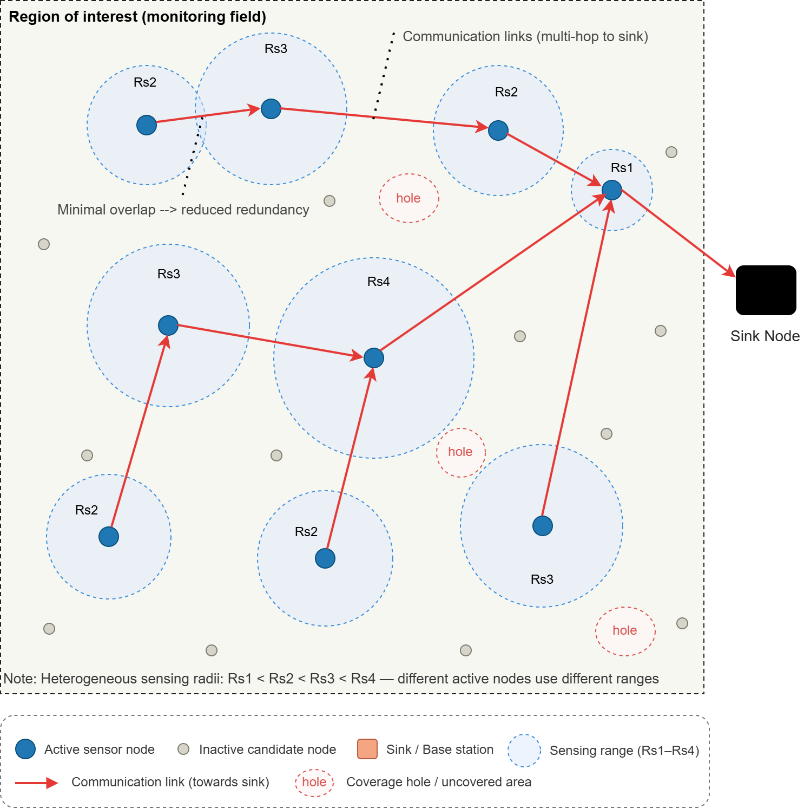
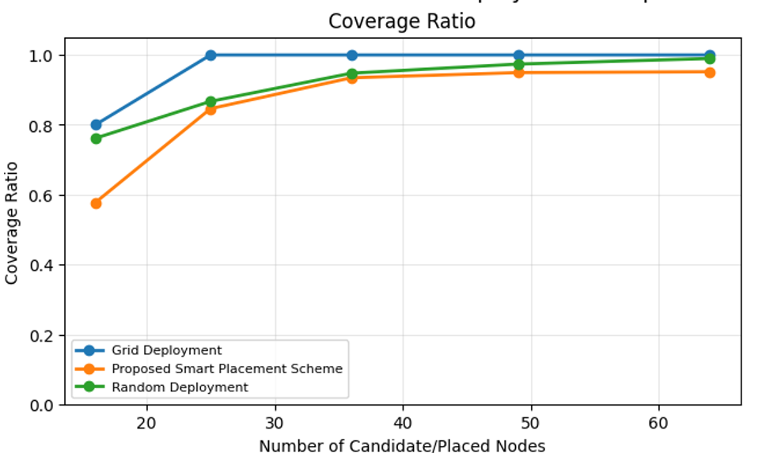
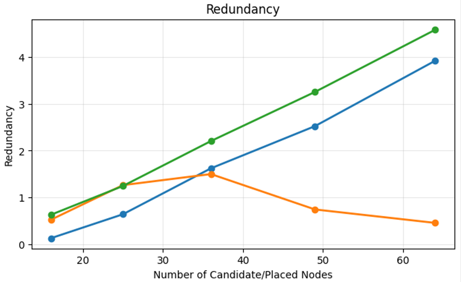
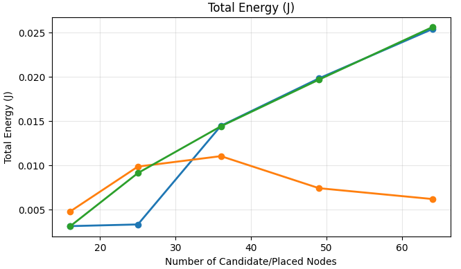
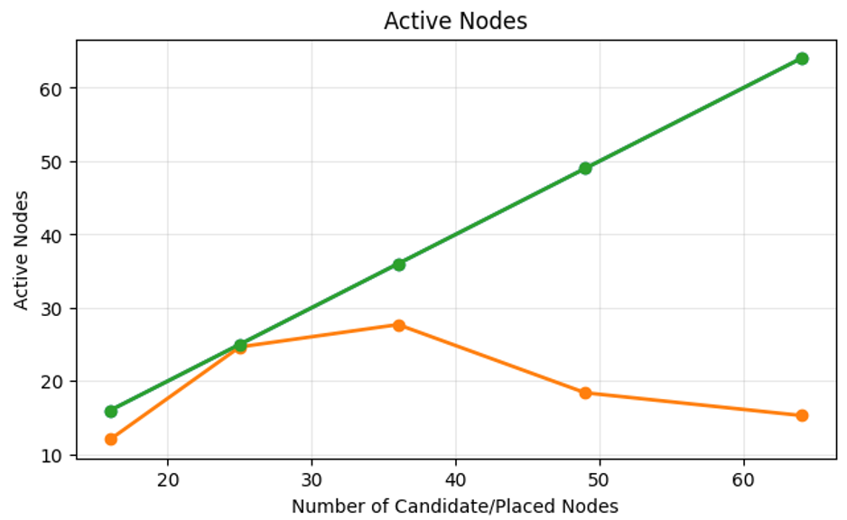
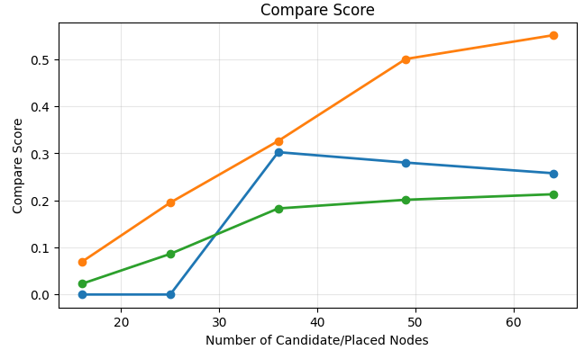
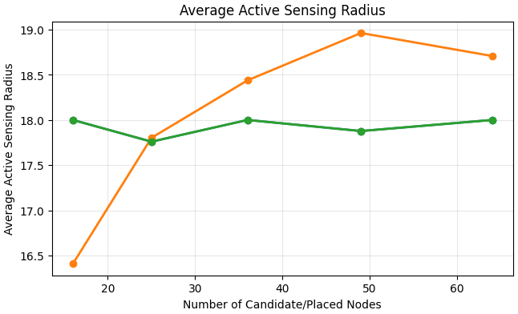

# Energy-Efficient Smart Node Selection for IoT-Based Wireless Sensor Networks

Python simulation project for selecting active sensor nodes in an IoT-based Wireless Sensor Network while reducing redundancy, energy consumption, and active node count.

---

## Project Context

This was a 3-person Wireless and Mobile Networks team project focused on IoT-based Wireless Sensor Networks.

This repository is a cleaned portfolio version of the project and focuses on the simulation, methodology, and results.

---

## Overview

Wireless Sensor Networks are commonly used in IoT applications such as smart cities, industrial monitoring, and environmental sensing. In these systems, activating too many sensor nodes can increase energy consumption and create redundant sensing overlap.

This project proposes a smart node selection scheme that selects only a subset of active sensor nodes from a larger set of candidate nodes.

The goal is to maintain strong sensing coverage while reducing:

- redundant sensing overlap,
- total energy consumption,
- number of active nodes,
- and loss of sink connectivity.

The proposed method is compared against two baseline approaches:

- Random deployment
- Grid deployment

---

## My Contributions

- Contributed to the Python-based WSN simulation.
- Helped implement the smart node selection heuristic.
- Evaluated coverage, redundancy, energy consumption, active node count, and sink connectivity.
- Ran simulation experiments across multiple node counts and independent trials.
- Contributed to result analysis, visualization, and the final IEEE-style report.

---

## Tech Stack

| Category | Tools / Concepts |
|---|---|
| Programming | Python |
| Simulation | Google Colab / Jupyter Notebook |
| Data Analysis | NumPy, pandas |
| Visualization | Matplotlib |
| Domain | Wireless Sensor Networks, IoT |
| Optimization Approach | Heuristic node selection |

---

## Methodology

The simulation models a two-dimensional monitoring field with candidate sensor nodes and a sink node.

Instead of activating all candidate nodes, the proposed heuristic selects active nodes based on a node selection score.

Each candidate node is evaluated using:

- coverage gain,
- redundancy increase,
- estimated energy cost,
- and sink connectivity feasibility.

The highest-scoring feasible node is selected repeatedly until the target coverage requirement is reached or no more feasible candidates remain.

---

## Node Selection Score

The node selection score balances three main factors:

```text
Score = coverage gain - redundancy penalty - energy cost penalty
```

A node is only considered feasible if it helps preserve connectivity to the sink.

This allows the algorithm to prioritize nodes that add useful coverage while avoiding unnecessary overlap and energy waste.

---

## Simulation Setup

| Parameter | Value |
|---|---|
| Monitoring field | 100 × 100 m |
| Sink position | (110, 50) m |
| Target grid | 25 × 25 points |
| Total target points | 625 |
| Candidate node counts | 16, 25, 36, 49, 64 |
| Sensing radii | 12, 16, 20, 24 m |
| Communication radius | 2 × sensing radius |
| Coverage target | 0.95 |
| Number of trials | 20 |
| Random seed | 7 |

---

## Compared Methods

### Random Deployment

Sensor nodes are placed randomly in the monitoring field. This approach is simple but may create uneven coverage, weak connectivity, and high redundancy.

### Grid Deployment

Sensor nodes are placed uniformly using a grid structure. This usually gives high coverage but may activate too many nodes and increase redundant overlap.

### Proposed Smart Node Selection Scheme

Candidate nodes are evaluated using the proposed heuristic, and only useful nodes are selected as active nodes. This reduces redundancy and energy consumption while preserving sink connectivity.

---

## Evaluation Metrics

The project evaluates each method using the following metrics:

| Metric | Description |
|---|---|
| Coverage Ratio | Fraction of target points covered by active nodes |
| Redundancy | Amount of unnecessary overlapping sensing coverage |
| Total Energy | Estimated operational energy consumption |
| Active Nodes | Number of selected active sensor nodes |
| Connectivity | Whether selected nodes remain connected to the sink |
| Average Sensing Radius | Average sensing range of selected active nodes |
| Compare Score | Combined score used to rank deployment methods |

---

## Results Summary

The proposed smart node selection scheme achieved the best overall tradeoff compared with random and grid deployment.

Main observations:

- Grid deployment often achieved the highest raw coverage, but it used all available nodes.
- Random deployment became increasingly redundant at higher node counts.
- The proposed method reduced redundancy at medium and high node densities.
- The proposed method reduced total energy consumption by activating fewer useful nodes.
- The proposed method preserved full sink connectivity in the tested scenarios.
- At higher node counts, the proposed scheme achieved competitive coverage while using significantly fewer active nodes.

---

## Visual Results

### System Model

The system model shows the monitoring field, candidate sensor nodes, selected active nodes, heterogeneous sensing ranges, communication links, and the sink node.



---

### Coverage Ratio



---

### Redundancy



---

### Total Energy Consumption



---

### Active Node Count



---

### Compare Score



---

### Average Active Sensing Radius



---

## Repository Structure

```text
energy-efficient-wsn-node-selection/
├── README.md
├── notebook/
│   └── wsn_node_selection_simulation.ipynb
├── report/
│   └── wsn_node_selection_report_sanitized.pdf
└── results/
    └── figures/
        ├── system_model.png
        ├── coverage_ratio.png
        ├── redundancy.png
        ├── total_energy.png
        ├── active_nodes.png
        ├── compare_score.png
        └── average_sensing_radius.png
```

---

## How to Run

Open the notebook in Google Colab or Jupyter Notebook:

```text
notebook/wsn_node_selection_simulation.ipynb
```

Run the notebook from top to bottom.

The notebook performs the simulation, compares deployment methods, and generates the evaluation plots and result tables.

---

## Report

A sanitized version of the final IEEE-style report is included in:

```text
report/wsn_node_selection_report_sanitized.pdf
```

Personal emails, student IDs, and private course submission details are removed from the public version.

---

## Limitations

The current simulation assumes:

- a static monitoring field,
- fixed node positions,
- fixed traffic behavior,
- no node failures,
- and a simplified energy model.

Future work could extend the simulation to dynamic environments, adaptive traffic patterns, node failure scenarios, or more advanced optimization methods.

---

## Future Improvements

- Add support for dynamic node failures.
- Test larger network sizes.
- Compare against additional optimization algorithms.
- Add interactive visualization of selected active nodes.
- Improve the energy model with more realistic communication behavior.
- Convert the notebook into modular Python scripts.

---

## Project Note

This repository is a cleaned portfolio version of a university team project. It is shared to demonstrate the simulation approach, heuristic design, and result analysis without exposing personal or private course information.

---

## Author

**Alaa Shammout**  
Computer Engineering  
American University of Sharjah
